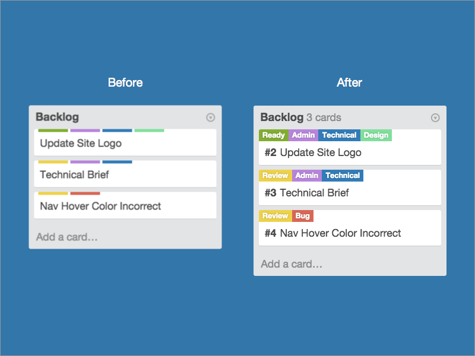

## Chuck Enhancements for Trello

Tiny enhancements for easier communication in a team.

1. Expanded labels
2. Cards count
3. Card numbers

## Contributing

1. Fork it
2. Create your feature branch (`git checkout -b my-new-feature`)
3. Commit your changes (`git commit -am 'Add some feature'`)
4. Push to the branch (`git push origin my-new-feature`)
5. Create new Pull Request`
